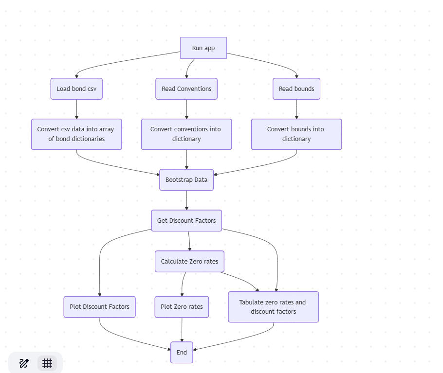
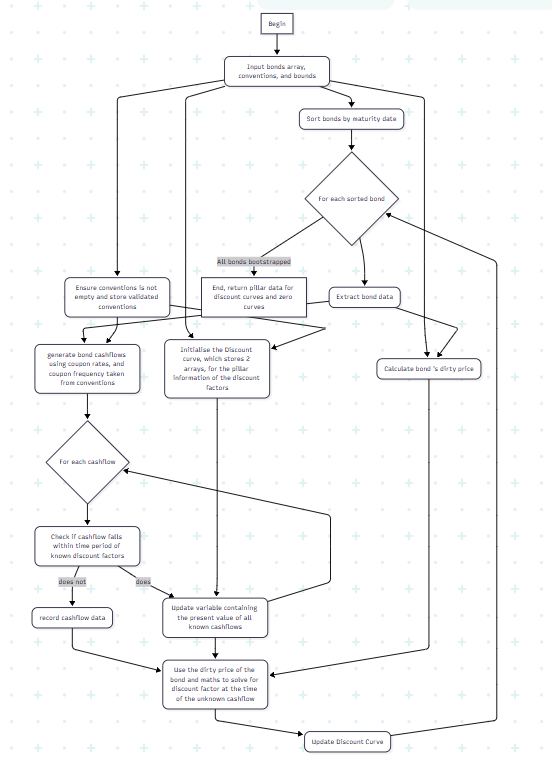

## Diagram depicting the logic behind the Webapp operation



## Diagram depicting the logic behind the bootstrapping algorithm
Attached is a picture of the mermaid diagram. However, the writing is a bit small, so if you are unable to see it clearly, please copy the below code into a mermaid code editor.



```
flowchart TD
    A[Begin] --> B(Input bonds array, conventions, and bounds)
    B --> C(Sort bonds by maturity date)
    B --> D(Ensure conventions is not empty and store validated conventions)
    B --> E(Initialise the Discount curve, which stores 2 arrays, for the pillar information of the discount factors)
    D --> E
    C --> F{For each sorted bond}
    F --> G(Extract bond data)
    G --> H(generate bond cashflows using coupon rates, and coupon frequency taken from conventions)
    D --> H
    B --> I(Calculate bond 's dirty price)
    G --> I
    H --> J{For each cashflow}
    J --> K(Check if cashflow falls within time period of known discount factors)
    K -- does --> L(Update variable containing the present value of all known cashflows)
    E --> L
    K -- does not --> M(record cashflow data)
    M --> N(Use the dirty price of the bond and maths to solve for discount factor at the time of the unknown cashflow)
    L --> N
    I --> N
    N --> O(Update Discount Curve)
    O --> F
    L --> J
    F -- All bonds bootstrapped --> P[End, return pillar data for discount curves and zero curves]
```

# Other Documents
previous - [Bootstrapping Algorithm](bootstrap.md) - What Bootstrapping is and how to perform it.

next - [Input Format](input_format.md) - Required csv format for the app to run successfully