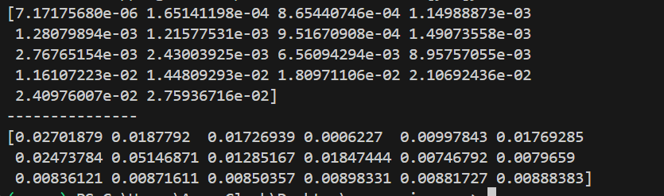
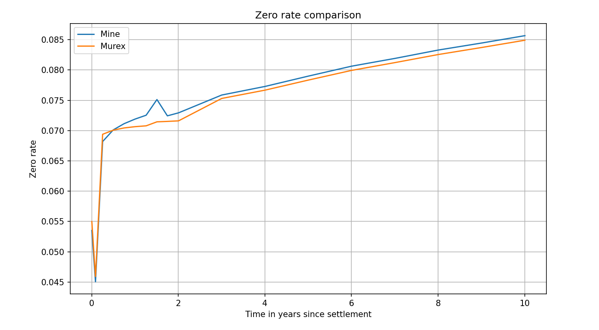

# Comparison method

Government bond data was run through this bootstrapper with output discount factors and zero rates stored in appropriate arrays, which were then compared entry by entry to the discount factors and zero-rates provided by Murex themselves. The datasets were plotted against one another for visual comparison and the relative error of this bootstrapper's results were explicitly calculated using:

$$ Error = \frac{|Expected-Actual|}{Expected}$$

## Relative Errors compared to Murex dataset

Top: relative errors of discount factors.

Bottom: relative errors of zero rates.

## Visualisation of Discount Curve comparison:

## Visualisation of Zero Curve comparison:

# Discussion:

The curves generated by this program match the curves generated by Murex well, but not exceptionally. The relative error of the **Discount Curve** remains below 3% at all times while the relative error of the **Zero Curve** spikes abruptly to 5% near the beginning before easing below 1% soon after. Thus, the bootstrapping algorithm is passes loose tolerance tests, but fails stricter ones. A primary source of error has been found.

## Inputted data
This program bootstraps bonds on the assumption that all bonds have the same settlement date. An assumption that was not met when tested on the provided Murex data. While most bonds provided had settlement date 2 October 2025, there were several datapoints with settlement dates in mid 2026 to mid 2027. The bonds with these settlement dates indeed seem to cause the abrupt spike in the error of the zero rates, suggesting that these datapoints are a major source of corruption for the bootstrapping output.

It is also impossible to forcibly neglect these datapoints as doing so leaves a gap between bond maturities too big for the bootstrapper to handle (more than one year).

# Other Documents
previous - [Input Format](input_format.md) - Required csv format for the app to run successfully

next - 