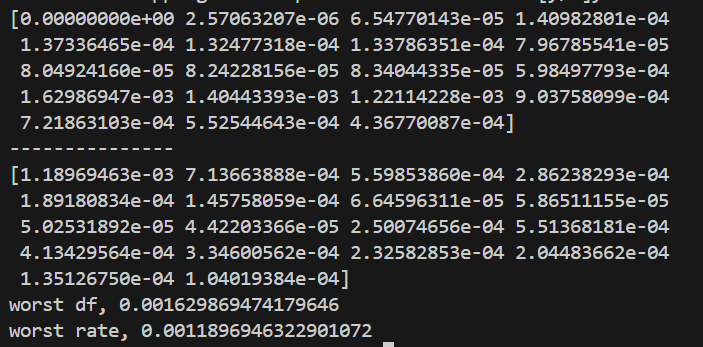
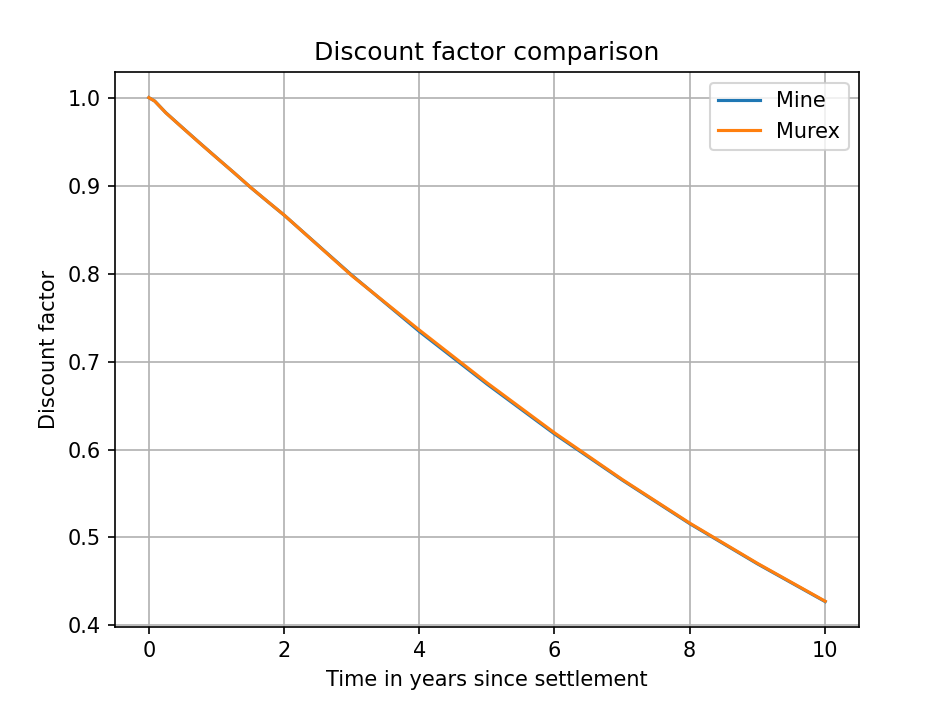
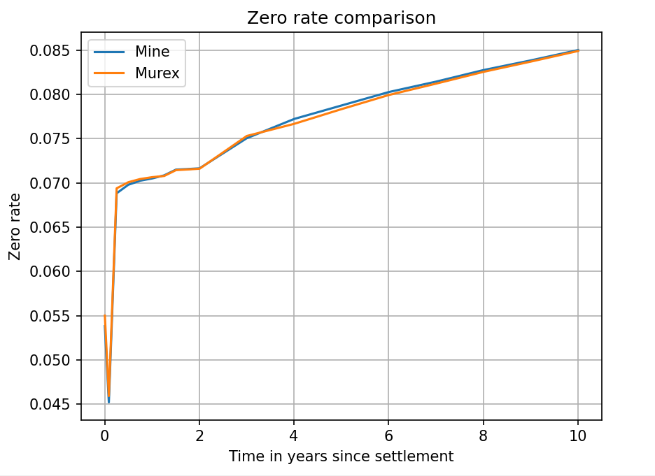

# Comparison method

Government bond data was run through this bootstrapper with output discount factors and zero rates stored in appropriate arrays, which were then compared entry by entry to the discount factors and zero-rates provided by Murex themselves. The datasets were plotted against one another for visual comparison and the relative error of this bootstrapper's results were explicitly calculated using:

### Setup

The Murex data was provided by Lisa on the 20'th. The data provided was copied into suitable csv files: A file containing the inputs, which were to be run through my code and compared against the data in another csv file containing the Murex outputs.

$$ Error = \frac{|Expected-Actual|}{Expected}$$

## Relative Errors compared to Murex dataset

Top: relative errors of discount factors.

Bottom: relative errors of zero rates.

## Visualisation of Discount Curve comparison:

## Visualisation of Zero Curve comparison:

# Discussion:

The curves generated by this program match the curves generated by Murex well, but not exceptionally. The relative error of the **Discount Curve** remains below 0.17% at all times and the relative error of the **Zero Curve** remains below 0.12%. Both curves are at their most inaccurate at 3-4 years after the first settlement date.

This time falls in the early period of swap bootstrapping as opposed to bond or FRA bootstrapping. Thus, the error is simple to pinpoint. After the second year, all instruments bootstrapped are swaps, thus the Murex data provided is the expected data from swap bootstrapping. However, my program only treats the very first instrument after t=2 years as a swap. This difference naturally explains the discrepency between the 2 curves

### Why am I only treating the first swap as a swap?

As explained in **bootstrap.md**, the formula used to generate new discount factors from swaps is only an approximate formula. Given as such, iteratively using this formula on top of itself leads to an increasingly poor approximation, and a larger discrepency between expected and actual results. Therefore I have opted to only use the swap bootstrapping equation once, on accurate data generated from FRA bootstrapping. Doing it this way resolves the greatest discrepency between the expected and actual zero curves, which occurs at t=3 years, while also leaving the data for t>= 4 years uncorrupted.

# Other Documents
previous - [Input Format](input_format.md) - Required csv format for the app to run successfully

next - [Further notes](Day_11.md) - Personal notes on more complicated instruments than bonds.